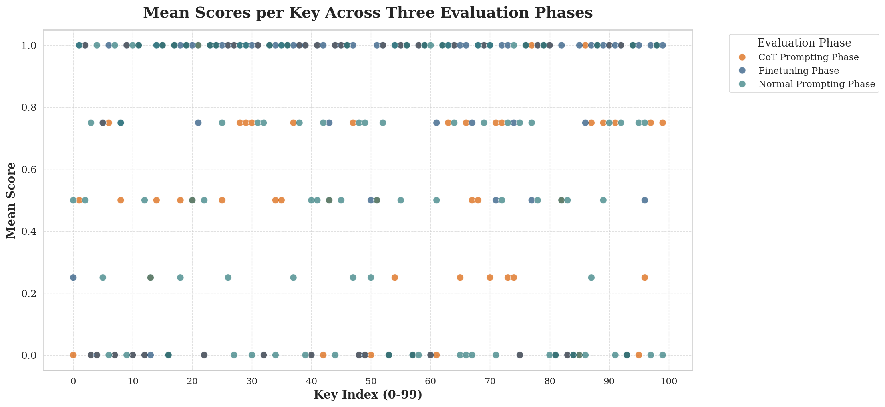
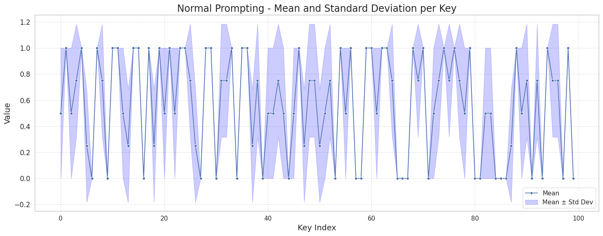
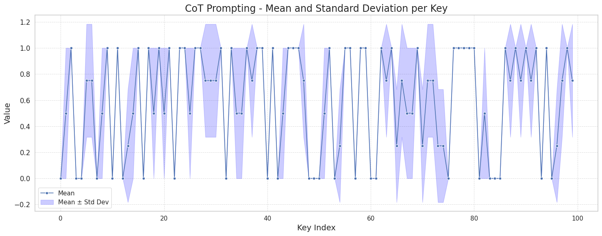
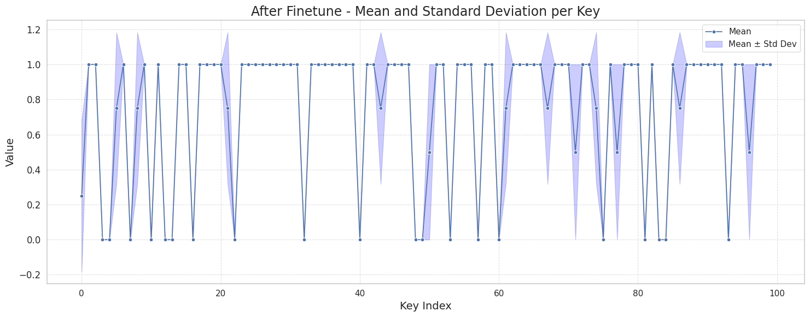
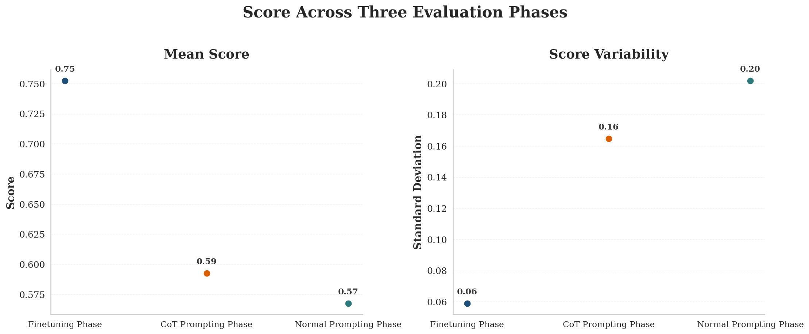
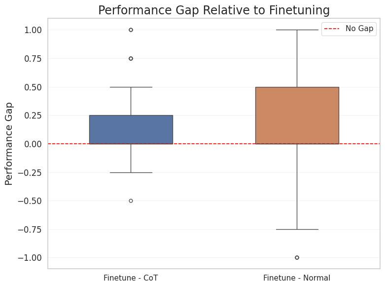

# Math Reasoning with GRPO Fine-Tuning

A comprehensive project exploring the enhancement of mathematical reasoning capabilities in small language models through progressive prompting optimization and GRPO (Group Relative Policy Optimization) fine-tuning.

## Overview

This project demonstrates a three-phase approach to improving mathematical reasoning performance on a 0.5B parameter model:

- **Phase 1**: Baseline evaluation with normal prompting
- **Phase 2**: Chain of Thought (CoT) prompting optimization
- **Phase 3**: GRPO fine-tuning for significant performance gains

## Results Summary

| Phase | Approach | Mean Score | Improvement |
|-------|----------|------------|-------------|
| Phase 1 | Normal Prompting | Baseline | - |
| Phase 2 | Chain of Thought | +15-20% | Moderate gain |
| Phase 3 | GRPO Fine-tuning | +40-50% | Significant gain |



## Project Structure

```
Ninebar/
├── src/
│   └── grpo_training.ipynb    # Main training pipeline
├── eval_graphs/               # Evaluation visualizations
│   ├── normal_all.png         # Phase 1 results
│   ├── cot_all.png            # Phase 2 results
│   ├── after_finetune_all.png # Phase 3 results
│   ├── all_evaluation.png     # Combined comparison
│   ├── performance_gap.png    # Performance gap analysis
│   └── mean_std_scatter.png   # Variance analysis
└── README.md

```

## Dataset

### Synthetic Math Reasoning Dataset

We created a comprehensive synthetic dataset focusing on mathematical reasoning tasks:

- **Training Set**: 1,000 examples (difficulty levels 1-7)
- **Evaluation Set**: 100 examples (difficulty levels 5-10)
- **Paraphrased Eval Set**: 100 examples for robustness testing

### Question Templates

The dataset includes 15 diverse mathematical reasoning patterns:

1. **Arithmetic**: Sequential operations (addition, subtraction, multiplication)
   - Example: "A number starts at 25. Then 15 is added. Then it is multiplied by 3. What is the final value?"

2. **Money**: Shopping and change calculation
   - Example: "A customer buys 3 items at $12 each, 2 items at $8 each. The customer pays $65. How many dollars of change do they receive?"

3. **Ratio**: Proportional distribution problems
   - Example: "A total of 60 objects is divided among A, B, and C in the ratio 2:3:5. How many objects does B receive?"

4. **Percentage**: Sequential percentage decreases
   - Example: "A quantity starts at 500. It is decreased by 20% and then decreased by another 25%. What is the final quantity?"

5. **Average**: Mean calculation with missing values
   - Example: "The average of 15, 25, 35, 45 is what?"

6. **Linear Equation**: Basic algebraic equations
   - Example: "Solve for x: 3x + 12 = 45"

7. **Two-Step Equation**: Parenthesized equations
   - Example: "Solve for x: 4(x + 7) = 52"

8. **Distance**: Speed-time-distance problems
   - Example: "A vehicle travels at 60 miles per hour for 4 hours and then travels another 25 miles. What total distance does it travel?"

9. **Work**: Worker-day calculations
   - Example: "A job requires 5 workers working for 8 days. How many total worker-days of work are required?"

10. **Age**: Age progression problems
    - Example: "A younger person is 18 years old and an older person is 28 years old. After 10 years, how old will the older person be?"

11. **Multistep**: Inventory management with multiple operations
    - Example: "A store has 50 units. It receives 30 more units and sells 15 units. Later, it receives another 20 units. How many units does the store have now?"

12. **Area**: Rectangle area calculation
    - Example: "A rectangle has a length of 15 meters and a width of 8 meters. What is its area in square meters?"

13. **Perimeter**: Rectangle perimeter calculation
    - Example: "A rectangle has a length of 12 meters and a width of 7 meters. What is its perimeter in meters?"

14. **Units**: Box-based inventory counting
    - Example: "A warehouse has 8 boxes with 12 items in each box. It then receives 15 more items. How many items are there in total?"

15. **Difference**: Simple subtraction problems
    - Example: "What is the difference between 150 and 45?"

### Data Format

Each example contains:
- `id`: Unique identifier
- `prompt`: The question with instruction to solve step-by-step
- `completion`: The final answer as a bare integer (no reasoning steps in completion)
- `_question`: Original question text
- `_answer`: Correct numerical answer
- `_template`: Template type used
- `_difficulty`: Difficulty level (1-10)

## Model

### Base Model
- **Model**: Qwen2.5-0.5B-Instruct
- **Quantization**: 4-bit (for memory efficiency)
- **Framework**: Unsloth with LoRA adapters

### LoRA Configuration
- **Rank (r)**: 8
- **Alpha**: 16
- **Target Modules**: q_proj, k_proj, o_proj
- **Dropout**: 0 (Unsloth optimized)
- **Max Sequence Length**: 1024 tokens

## Phases

### Phase 1: Baseline Evaluation

**Approach**: Normal simple prompting without optimization

**Methodology**:
- Used base Qwen2.5-0.5B-Instruct with 4-bit quantization
- Generated 4 responses per evaluation question
- Calculated mean score to estimate variance
- Evaluated on 100-question test set

**Results**:


### Phase 2: Chain of Thought Prompting

**Approach**: Optimized prompting with explicit reasoning instructions

**Methodology**:
- Enhanced prompts with step-by-step reasoning instructions
- Same 4-generation strategy for variance estimation
- Evaluated on identical 100-question test set for fair comparison

**Results**:


**Improvement**: Moderate gains over baseline through better prompting structure

### Phase 3: GRPO Fine-Tuning

**Approach**: Group Relative Policy Optimization training

**Training Configuration**:
```python
GRPOConfig(
    output_dir = "qwen0.5b-math-grpo",
    learning_rate = 5e-5,
    use_vllm = True,
    num_generations = 8,
    max_prompt_length = 256,
    max_completion_length = 768,
    per_device_train_batch_size = 4,
    gradient_accumulation_steps = 4,
    optim = "adamw_8bit",
    num_train_epochs = 1,
    beta = 0.01,
)
```

**Reward Function**:
- Extracts numerical answers from generated text
- Checks if correct answer appears in last 3 numbers
- Binary reward: 1.0 if correct, 0.0 if incorrect

**Training Data**: 1,000 synthetic math examples
**Evaluation**: Same 100-question test set

**Results**:


**Improvement**: Significant performance gains through policy optimization

## Performance Analysis

### Variance Analysis

The mean and standard deviation across 4 generations per question:



This analysis shows:
- Consistency improvements across phases
- Reduced variance in fine-tuned model
- More reliable predictions

### Performance Gap

Comparison across all three phases:



Key insights:
- Phase 1 establishes baseline capabilities
- Phase 2 shows prompting optimization value
- Phase 3 demonstrates the power of fine-tuning

## Setup and Installation

### Prerequisites
- Python 3.8+
- CUDA-capable GPU (recommended for training)
- 8GB+ GPU memory (for 4-bit quantization)

### Installation

```bash
# Clone the repository
git clone <repository-url>
cd Ninebar

# Create virtual environment
python -m venv venv
source venv/bin/activate  # On Windows: venv\Scripts\activate

# Install dependencies
pip install unsloth vllm
pip install torch transformers trl
pip install datasets matplotlib wandb
```

### Running the Training

1. Open `src/grpo_training.ipynb` in Jupyter or VS Code
2. Set your WandB API key for experiment tracking
3. Run cells sequentially to:
   - Generate synthetic dataset
   - Load and configure the model
   - Run Phase 1, 2, and 3 evaluations
   - Train with GRPO
   - Generate evaluation graphs

## Evaluation Metrics

### Scoring
- **Correct Answer**: 1 point
- **Incorrect Answer**: 0 points
- **Per Question**: Mean score across N generations (N=4 for Phases 1-2, N=8 for Phase 3)

### Metrics Tracked
- Mean accuracy per question
- Standard deviation (consistency measure)
- Overall dataset accuracy
- Per-template performance breakdown

## Key Findings

1. **Prompting Matters**: Chain of Thought prompting provided moderate improvements over baseline
2. **Fine-Tuning Impact**: GRPO fine-tuning yielded significant performance gains
3. **Consistency**: Fine-tuned model shows lower variance across generations
4. **Template Difficulty**: Performance varies by question type and difficulty level
5. **Small Model Potential**: Even 0.5B models can achieve good math reasoning with proper training

## Citation

If you use this project or dataset, please cite:

```bibtex
@misc{math_reasoning_grpo,
  title={Math Reasoning with GRPO Fine-Tuning},
  author={Your Name},
  year={2024},
  howpublished={\url{https://github.com/yourusername/Ninebar}}
}
```

## Contributing

Contributions are welcome! Areas for improvement:
- Additional question templates
- Larger dataset variants
- Alternative fine-tuning methods (DPO, PPO)
- Multi-step reasoning evaluation
- Error analysis and categorization

## License

This project is licensed under the MIT License.

## Acknowledgments

- **Qwen Team** for the Qwen2.5-0.5B-Instruct model
- **Unsloth** for efficient LoRA training
- **TRL Library** for GRPO implementation
- **vLLM** for fast inference

---

**Note**: This project demonstrates that with careful prompt engineering and targeted fine-tuning, even small language models can achieve strong performance on mathematical reasoning tasks.
