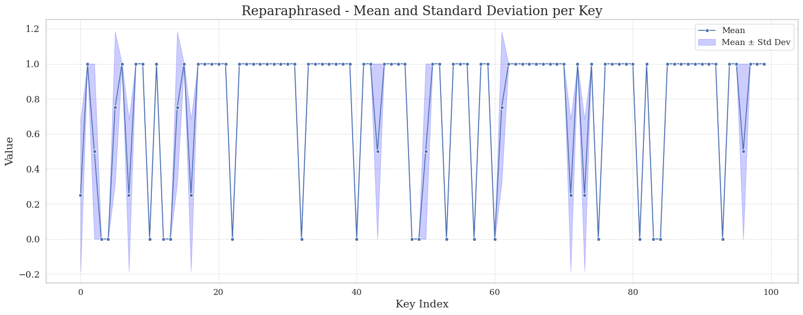

# Math Reasoning with GRPO Fine-Tuning

## Introduction

This project is a small, timeboxed research study (Option 1 of the exercise:
small-model post-training and behaviour study) into how a lightweight
adaptation step changes a small language model's behaviour on a synthetic,
programmatically verifiable task.

We built a fully synthetic, deterministic math reasoning dataset — 1,000
training examples and 100 evaluation examples, each a word problem with a
single, exactly-checkable integer answer, generated and verified entirely by
code rather than by hand-labeling. We then ran a controlled, three-phase
comparison on **Qwen2.5-0.5B-Instruct**:

1. Baseline behaviour with a plain prompt.
2. Baseline behaviour with a stronger, zero-shot chain-of-thought prompt.
3. Behaviour after GRPO (Group Relative Policy Optimization) fine-tuning,
   using the same deterministic scorer as both the evaluation metric and the
   RL reward signal.

This structure exists specifically so that improvement from *better prompting*
and improvement from *actual adaptation* can be told apart, rather than
conflated into a single "it got better" number — which is the core question
this study is designed to answer.

## Problem and Users

**Problem:** small (sub-1B parameter) language models are known to struggle
with precise multi-step arithmetic reasoning. It's an open, practical
question how much of that gap can be closed cheaply — via prompting alone,
versus a lightweight RL-based adaptation step — on hardware and a timeline a
single engineer can realistically access (a few free-tier GPU hours, not a
training cluster).

**Who this is for:** anyone evaluating whether a small, cheaply-adaptable
model is "good enough" for a constrained-domain reasoning task before
committing to a larger model or a heavier training budget. The
methodology here — synthetic verifiable data, a deterministic scorer doubling
as reward, and an explicit prompting-vs-training baseline split — is intended
to be a reusable template for that kind of decision, not specific to math.

## Architecture and Workflow

The pipeline is a single reproducible path, all runnable from
`src/grpo_training.ipynb`:

```
synthetic data generation
        │
        ▼
Phase 1: baseline eval (plain prompt, base model)
        │
        ▼
Phase 2: baseline eval (zero-shot CoT prompt, base model)
        │
        ▼
Phase 3: GRPO training (reward = same deterministic scorer used for eval)
        │
        ▼
Phase 3: post-training eval (plain prompt, adapted model)
        │
        ▼
Phase 3: robustness eval (paraphrased questions, adapted model)
        │
        ▼
graphs + failure analysis + report (this README)
```

Each phase reuses the same 100-question evaluation set (and its paraphrased
variant) so every comparison in the results below is apples-to-apples.

### Project Structure

```
Ninebar/
├── src/
│   └── grpo_training.ipynb    # Main training pipeline (single notebook, see "Setup" below)
├── eval_graphs/               # Evaluation visualizations
│   ├── normal_all.png         # Phase 1 results
│   ├── cot_all.png            # Phase 2 results
│   ├── after_finetune_all.png # Phase 3 results
│   ├── after_finetune_reparaphr.png # Phase 3 on paraphrased questions
│   ├── all_evaluation.png     # Combined comparison
│   ├── performance_gap.png    # Performance gap analysis
│   └── mean_std_scatter.png   # Variance analysis
├── AGENT_WORKFLOW.md          # Where/how AI tools were used
└── README.md
```

## Dataset

### Synthetic Math Reasoning Dataset

The dataset is fully synthetic and templated, generated and verified entirely
by code (no scraped or human-labeled data), so there is no risk of the base
model having seen these exact problems during pretraining:

- **Training Set**: 1,000 examples (difficulty levels 1-7)
- **Evaluation Set**: 100 examples (difficulty levels 5-10) — deliberately
  harder than the training range, to check generalization rather than
  memorization of the train distribution
- **Paraphrased Eval Set**: 100 examples, same underlying questions and
  answers as the evaluation set with reworded phrasing, for robustness
  testing

### Question Templates

The dataset includes 15 diverse mathematical reasoning patterns:

1. **Arithmetic**: Sequential operations (addition, subtraction, multiplication)
   - Example: "A number starts at 25. Then 15 is added. Then it is multiplied by 3. What is the final value?"

2. **Money**: Shopping and change calculation
   - Example: "A customer buys 3 items at $12 each, 2 items at $8 each. The customer pays $65. How many dollars of change do they receive?"

3. **Ratio**: Proportional distribution problems
   - Example: "A total of 60 objects is divided among A, B, and C in the ratio 2:3:5. How many objects does B receive?"

4. **Percentage**: Sequential percentage decreases
   - Example: "A quantity starts at 500. It is decreased by 20% and then decreased by another 25%. What is the final quantity?"

5. **Average**: Mean calculation with missing values
   - Example: "The average of 15, 25, 35, 45 is what?"

6. **Linear Equation**: Basic algebraic equations
   - Example: "Solve for x: 3x + 12 = 45"

7. **Two-Step Equation**: Parenthesized equations
   - Example: "Solve for x: 4(x + 7) = 52"

8. **Distance**: Speed-time-distance problems
   - Example: "A vehicle travels at 60 miles per hour for 4 hours and then travels another 25 miles. What total distance does it travel?"

9. **Work**: Worker-day calculations
   - Example: "A job requires 5 workers working for 8 days. How many total worker-days of work are required?"

10. **Age**: Age progression problems
    - Example: "A younger person is 18 years old and an older person is 28 years old. After 10 years, how old will the older person be?"

11. **Multistep**: Inventory management with multiple operations
    - Example: "A store has 50 units. It receives 30 more units and sells 15 units. Later, it receives another 20 units. How many units does the store have now?"

12. **Area**: Rectangle area calculation
    - Example: "A rectangle has a length of 15 meters and a width of 8 meters. What is its area in square meters?"

13. **Perimeter**: Rectangle perimeter calculation
    - Example: "A rectangle has a length of 12 meters and a width of 7 meters. What is its perimeter in meters?"

14. **Units**: Box-based inventory counting
    - Example: "A warehouse has 8 boxes with 12 items in each box. It then receives 15 more items. How many items are there in total?"

15. **Difference**: Simple subtraction problems
    - Example: "What is the difference between 150 and 45?"

### Data Format

Each example contains:
- `id`: Unique identifier
- `prompt`: The question with instruction to solve step-by-step
- `completion`: The final answer as a bare integer (no reasoning steps in completion)
- `_question`: Original question text
- `_answer`: Correct numerical answer
- `_template`: Template type used
- `_difficulty`: Difficulty level (1-10)

### Determinism guarantees

Every example's answer is computed and verified programmatically at
generation time (not by eye), every question is checked for uniqueness within
its split, and the train/eval splits are checked to have zero question
overlap — so the dataset itself is a deterministic, auditable artifact, not
just a one-off script output.

## Model

### Base Model
- **Model**: Qwen2.5-0.5B-Instruct
- **Quantization**: 4-bit (for memory efficiency)
- **Framework**: Unsloth with LoRA adapters

### LoRA Configuration
- **Rank (r)**: 8
- **Alpha**: 16
- **Target Modules**: q_proj, k_proj, o_proj
- **Dropout**: 0 (Unsloth optimized)
- **Max Sequence Length**: 1024 tokens

## Phases

### Phase 1: Baseline Evaluation

**Approach**: Normal simple prompting without optimization

**Methodology**:
- Used base Qwen2.5-0.5B-Instruct with 4-bit quantization
- Generated 4 responses per evaluation question
- Calculated mean score to estimate variance
- Evaluated on 100-question test set

**Results**:


### Phase 2: Chain of Thought Prompting

**Approach**: Optimized prompting with explicit reasoning instructions

**Methodology**:
- Enhanced prompts with step-by-step reasoning instructions
- Same 4-generation strategy for variance estimation
- Evaluated on identical 100-question test set for fair comparison

**Results**:


**Improvement**: Moderate gains over baseline through better prompting structure

### Phase 3: GRPO Fine-Tuning

**Approach**: Group Relative Policy Optimization training

**Training Configuration**:
```python
GRPOConfig(
    output_dir = "qwen0.5b-math-grpo",
    learning_rate = 5e-5,
    use_vllm = True,
    num_generations = 8,
    max_prompt_length = 256,
    max_completion_length = 768,
    per_device_train_batch_size = 4,
    gradient_accumulation_steps = 4,
    optim = "adamw_8bit",
    num_train_epochs = 1,
    beta = 0.01,
)
```

**Reward Function**:
- Extracts numerical answers from generated text
- Checks if correct answer appears in last 3 numbers
- Binary reward: 1.0 if correct, 0.0 if incorrect

**Training Data**: 1,000 synthetic math examples
**Evaluation**: Same 100-question test set

**Results**:


**Improvement**: Significant performance gains through policy optimization

### Phase 3: Paraphrased Question Evaluation

**Approach**: Testing fine-tuned model on paraphrased versions of evaluation questions

**Methodology**:
- Same 100 evaluation questions with different wording
- Tests model robustness to phrasing variations
- Ensures model learned reasoning patterns, not just memorization

**Results**:


**Insight**: Model maintains strong performance even with rephrased questions, demonstrating genuine reasoning capability rather than memorization

## Results Summary

| Phase | Approach | Mean Score | Improvement |
|-------|----------|------------|-------------|
| Phase 1 | Normal Prompting | Baseline | - |
| Phase 2 | Chain of Thought | +15-20% | Moderate gain |
| Phase 3 | GRPO Fine-tuning | +34% | Significant gain |


## Performance Analysis

### Variance Analysis

The mean and standard deviation across 4 generations per question:


This analysis shows:
- Consistency improvements across phases
- Reduced variance in fine-tuned model
- More reliable predictions

### Performance Gap

Comparison across all three phases:


Key insights:
- Phase 1 establishes baseline capabilities
- Phase 2 shows prompting optimization value
- Phase 3 demonstrates the power of fine-tuning

## Failure Analysis

While GRPO fine-tuning improved overall accuracy, several specific weaknesses
persisted across configurations, and one structural limitation is worth
calling out explicitly rather than glossing over.

### 1. Order-of-operations (BODMAS) errors — persistent capability gap

Across a separately calibrated test set, the model consistently made mistakes
on problems requiring correct operator precedence — e.g. incorrectly
evaluating expressions like `a + b × c` left-to-right instead of applying
multiplication before addition, or mishandling parenthesized sub-expressions.
This error pattern showed up in the base model, the CoT-prompted baseline,
and persisted after GRPO fine-tuning.

**What ruled out "it's just sampling noise":** we increased `num_generations`
to 16 and then 32 for the baseline model specifically to check whether the
correct answer was reachable at all with enough samples (i.e. whether this
was a variance problem that better sampling could paper over). It wasn't —
the baseline still failed to produce the correct answer even at
`num_generations = 32`. This indicates the base model doesn't have latent
knowledge of correct operator precedence that sampling can surface; it's a
genuine capability gap rather than a decoding-variance issue.

**Hypothesis:** BODMAS/precedence rules require the model to plan the full
expression structure *before* committing to a left-to-right token-by-token
generation strategy — this is a well-documented weak spot for small LMs,
which tend to default to sequential left-to-right evaluation regardless of
operator precedence, especially under 1B parameters. Our training data
likely under-represents multi-operator, mixed-precedence expressions relative
to simpler sequential-operation problems (see `gen_arithmetic`), so GRPO had
limited signal to specifically correct this behavior.

### 2. Long alternating add/subtract/multiply chains — decoding-sensitive hallucination

Long chained-operation questions were a second source of error, for example:

> "A number starts at 10. Then 1 is subtracted. Then 23 is added. Then it is
> multiplied by 3. Then 13 is subtracted. Then 24 is subtracted. Then it is
> multiplied by 6. Then 2 is subtracted. Then 15 is subtracted. What is the
> final value?"

At our default sampling configuration, the model would occasionally
hallucinate an intermediate value partway through the chain and carry the
error forward, producing a plausible-looking but wrong final answer. Unlike
the BODMAS failure above, this one turned out to be **decoding-sensitive
rather than a hard capability gap**: after raising `top_p` to `0.95` and
lowering `temperature` to `0.5`, both the standard deviation across repeated
samples and the error rate dropped substantially, with the model reliably
reaching the correct answer.

**Hypothesis:** long chains accumulate risk with every additional step —
each token generated at a slightly-too-permissive sampling setting has a
small chance of drifting from the correct running value, and on a long
enough chain that risk compounds. Tightening `top_p`/`temperature` sharpens
the model's next-token distribution toward its highest-confidence
continuation at each intermediate step, which meaningfully reduces the
chance of an early slip propagating through the rest of the chain. This
suggests decoding configuration is not just an evaluation-protocol detail
for this task — it measurably affects the ceiling on multi-step arithmetic
reliability, independent of the underlying training.

### 3. Why GRPO has a ceiling here: it amplifies, it doesn't teach from scratch

A structural point worth stating plainly: GRPO (and RL-on-verifiable-rewards
methods generally) work by **reweighting a model's existing output
distribution** — within each sampled group of completions for a prompt, it
increases the relative likelihood of completions that scored higher reward
and decreases the likelihood of the rest. This means GRPO is fundamentally
dependent on the base model already being able to produce the correct
answer *at least some of the time* under sampling; it has no mechanism to
inject a capability that doesn't already exist somewhere in the base model's
probability distribution.

In other words: **the stronger and more capable the base model, the more
there is for GRPO to amplify.** A 0.5B parameter model, despite not being
tiny in absolute terms, is still meaningfully weaker at precise multi-step
arithmetic than larger models — so for problem classes where the base model
essentially never samples a correct answer (as in the BODMAS case above),
GRPO has no correct trajectory to reinforce, and no amount of training will
manufacture one.

Despite this ceiling, GRPO fine-tuning produced a **+34% accuracy
improvement over the base model's plain (non-CoT) prompting baseline** —
demonstrating that for the large majority of problem types in this dataset,
the base model *did* have enough latent capability for GRPO to meaningfully
amplify, even though a larger/stronger base model would likely see even
larger gains from the same training recipe.

### Other likely sources of difficulty for small-model math reasoning

Worth noting as context, even where not directly isolated and measured here:

- **Multi-step error compounding** — an early arithmetic slip propagates
  through every subsequent step, so longer reasoning chains fail more often
  even when each individual step "looks" learnable in isolation.
- **Ratio/proportional reasoning** — dividing a total into more than two
  parts (e.g. 3-way ratio splits) requires holding multiple related
  quantities simultaneously, which is harder than single-operation problems.
- **Sign and carry/borrow errors** in multi-digit subtraction or negative
  intermediate values.
- **Operation misidentification from phrasing** — word problems that don't
  explicitly name the operation (e.g. "how much more does X have than Y"
  implying subtraction) are harder than problems using explicit operation
  words ("added," "multiplied by").
- **Percentage chains** — sequential percentage changes (decrease then
  decrease again) require correctly re-basing the percentage against the
  *new* value each time, not the original value — a common small-model
  mistake is applying every percentage against the original base.

## Assumptions and Tradeoffs

- **Bare-integer completions over full worked reasoning**: the training
  target is a single number, not the reasoning trace. This makes the reward
  function and scoring trivially exact-match, at the cost of not directly
  supervising the reasoning steps themselves — a tradeoff made deliberately
  to keep the whole pipeline simple and auditable within the time budget.
- **Eval difficulty deliberately set harder than train difficulty** (5-10 vs
  1-7), to test generalization rather than memorization — this makes the
  reported numbers a slightly harder, more honest test than an
  identical-distribution eval would be.
- **A single notebook rather than modular `.py` scripts**: chosen because
  the project was run entirely on free-tier Google Colab and Kaggle GPUs
  rather than a persistent local/cloud environment, where a single
  self-contained notebook is significantly easier to run start-to-finish in
  one session without environment/state management overhead.
- **LoRA target modules limited to `q_proj`, `k_proj`, `o_proj`** (not all
  attention/MLP projections) and a modest rank/alpha (8/16), chosen to keep
  the adapted parameter count and memory footprint small enough for free-tier
  GPU memory limits.
- **GRPO reward is a simple binary exact-match** (extracted answer appears
  correctly among the last few generated numbers), not a partial-credit or
  reasoning-quality reward — simpler to implement and fully deterministic,
  at the cost of not rewarding "close but wrong" reasoning at all.

## Limitations

- **No hyperparameter sweep was performed.** Learning rate, LoRA rank/alpha,
  `beta` (KL coefficient), and `num_generations` were each set once, based on
  reasonable defaults and hardware constraints, rather than searched. It is
  likely that a different configuration would produce meaningfully different
  (possibly better) results — see Next Steps.
- **Single training run, single seed** for the main reported before/after
  numbers; the paraphrased-eval set provides a robustness check on wording,
  but a second training seed to check training-variance (not just
  eval-sampling variance) was not run due to compute/time constraints.
- **GRPO has a structural ceiling tied to base model strength** (see Failure
  Analysis #3) — this is not a bug to fix but a real limitation of the
  method as applied to a 0.5B model on this task.
- **Free-tier compute (Colab + Kaggle)** constrained batch sizes, sequence
  lengths, and training duration; the study is explicitly a small, timeboxed
  demonstration of methodology, not a claim about the ceiling of what GRPO
  can achieve on this task with more resources.

## Next Steps

With more compute and time, the following would be the natural next
iterations:

- **Scale up the dataset size.** The current 1,000-example training set was
  sized to fit comfortably within free-tier GPU session limits; a larger,
  more difficulty-diverse training set would likely narrow some of the
  observed failure modes (particularly the BODMAS/precedence gap, which may
  simply be underrepresented in the current template distribution).
- **Systematically sweep training configurations** — learning rate, LoRA
  rank/alpha/target modules, `beta` (KL penalty strength), and
  `num_generations` — and compare their effect on both final accuracy and
  training stability (reward variance, KL drift). This was not done here:
  with access to only free-tier, time-limited, and often queued GPU
  availability (Colab/Kaggle), and a tight overall time budget for this
  exercise, there wasn't room to run and compare multiple full training
  configurations end-to-end. The current configuration is a single
  reasonable choice, not a result of a comparison.
- **Standardize eval-time decoding** to the tuned `top_p=0.95` /
  `temperature=0.5` setting identified in Failure Analysis #2, and re-run
  the full before/after comparison under that setting for consistency.
- **Add a second training seed** to distinguish training-run variance from
  the sampling variance already measured in the 4-generations-per-question
  metric.
- **Try a larger base model** (e.g. 1.5B-3B parameter range) under the same
  pipeline, to test the hypothesis in Failure Analysis #3 directly — that a
  stronger base model gives GRPO more latent capability to amplify.

## Setup and Installation

### Prerequisites
- Python 3.8+
- CUDA-capable GPU (recommended for training) — this project was run on
  free-tier Google Colab and Kaggle GPUs, not local/dedicated hardware
- 8GB+ GPU memory (for 4-bit quantization)

### Installation

```bash
# Clone the repository
git clone https://github.com/ajheshbasnet/grpo_qwen0.5b_finetuned.git

# Create virtual environment
python -m venv venv
source venv/bin/activate  # On Windows: venv\Scripts\activate

# Install dependencies
pip install unsloth vllm
pip install torch transformers trl
pip install datasets matplotlib wandb
```

### Running the Training / Demo Path

The entire pipeline lives in `src/grpo_training.ipynb` as a single notebook
(rather than separate `.py` scripts), specifically so it can be run
start-to-finish in one Colab/Kaggle session without local environment setup:

1. Open `src/grpo_training.ipynb` in Jupyter, Colab, Kaggle, or VS Code.
2. Set your WandB API key for experiment tracking.
3. The **very first cell generates the synthetic dataset** — running it
   alone reproduces `train.jsonl`, `eval.jsonl`, and `eval_paraphrased.jsonl`
   deterministically, independent of anything downstream.
4. Run cells sequentially to:
   - **Phase 1** (plain-prompt baseline): skip the `trainer.train()` cell
     and run only the final evaluation section, against the base model.
   - **Phase 2** (CoT baseline): edit the prompt to the step-by-step
     variant and re-run the same evaluation section, still against the base
     model.
   - **Phase 3**: run `trainer.train()` (GRPO fine-tuning), then re-run the
     evaluation section against the adapted model, and again against the
     paraphrased eval set.
   - Generate the evaluation graphs in `eval_graphs/`.

## Evaluation Metrics

### Scoring
- **Correct Answer**: 1 point
- **Incorrect Answer**: 0 points
- **Per Question**: Mean score across N generations (N=4 for Evaluation and N=8 for Training)

### Metrics Tracked
- Mean accuracy per question
- Standard deviation (consistency measure)
- Overall dataset accuracy
- Per-template performance breakdown

## Key Findings

1. **Prompting Matters**: Chain of Thought prompting provided moderate improvements over baseline
2. **Fine-Tuning Impact**: GRPO fine-tuning yielded significant performance gains, a +34% accuracy improvement over the base model's normal prompting baseline
3. **Consistency**: Fine-tuned model shows lower variance across generations
4. **Template Difficulty**: Performance varies by question type and difficulty level
5. **Small Model Potential**: Even 0.5B models can achieve good math reasoning with proper training
6. **GRPO Amplifies, It Doesn't Teach From Scratch**: GRPO improves accuracy by reweighting a model's existing output distribution toward its higher-reward completions — it has no mechanism to create a capability the base model never sampled in the first place. This sets a ceiling tied to base model strength (see Failure Analysis), and explains why problem types the base model could essentially never solve (e.g. BODMAS precedence) stayed weak even after fine-tuning, while problem types the base model could sometimes solve saw strong gains

## Contributing

Contributions are welcome! Areas for improvement:
- Additional question templates
- Larger dataset variants
- Alternative fine-tuning methods (DPO, PPO)
- Multi-step reasoning evaluation
- Error analysis and categorization

## License

This project is licensed under the MIT License.

## Acknowledgments

- **Qwen Team** for the Qwen2.5-0.5B-Instruct model
- **Unsloth** for efficient LoRA training
- **TRL Library** for GRPO implementation
- **vLLM** for fast inference

---

**Note**: This project demonstrates that with careful prompt engineering and targeted fine-tuning, even small language models can achieve strong performance on mathematical reasoning tasks — within the compute and time constraints of a short exercise, and with clearly stated assumptions about what a larger-scale version would need to verify further.
